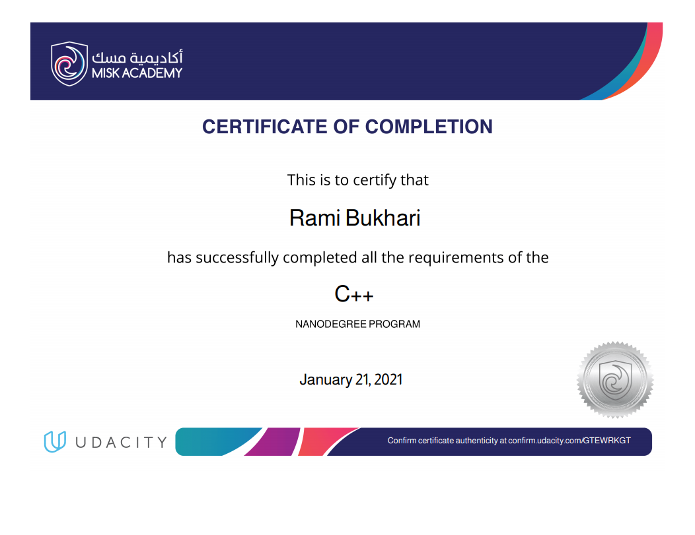

# My Journey in C++ Nanodegree by Udacity

## Introduction

This is my attempt to document my jorney in [Udacity C++ Nanodegree Program](https://www.udacity.com/course/c-plus-plus-nanodegree--nd213). The program has 4 courses each with its project, and one final (capstone) project of the student choice. The entire program took me around 4 months and I was sponsored by [Misk Academy](https://www.miskacademy.edu.sa/).

I really enjoyed the material of the program. This is the 3rd nanodegree I take with Udacity and this one I think has the highest quality. These are some of the most think I like about the program.

- The quality of the lessons, videos, practice problems and project are the best among other nanodegrees (at least the one I took, front-end ND and React ND)
- The program is co-presented with the father of C++ himself [Bjarne Stroustrup](https://en.wikipedia.org/wiki/Bjarne_Stroustrup). It's an honor to learn from him
- The program focuses on best practices of the industry
- I enjoyed working on the projects. They teach the students how to deal with large code base and learn the important parts quickly so they can achieve the required tasks. This is very valuable skill
- The last project is not restricted, which enables the students to be creative, and also it teaches the student how to write documentation

Overall, I give this nanodegree 4.5/5. I totally recommend it to programmers who have good programming skills but want to broaden their knowledge in writing good, memory effecient, multi-threaded applications.

This is the [syllabus](syllabus.pdf) for more information. Below are some brief explination of each course with the link to the project repository I made.

## C++ Foundation
### [Project: OpenStreetMap Route Planner](https://github.com/RamiB1234/OpenStreetMap-Route-Planner)
In this course, I revised the basics of C++. The project of this course is very interesting to me. It's a route planner (similar to the navigation apps) that utilized [A* search algorithm](https://en.wikipedia.org/wiki/A*_search_algorithm) to find the shortest path between two points and draw the path.

## Object-Oriented Programming
### [Project: Linux System Monitor](https://github.com/RamiB1234/linux-system-monitor)
In this course, I learned the OOP part of C++ (Yes, it supports C style linear-programming). This course covers some advance topics like polymorphism, mutiple inheritance and templates. The project was to build a system monitor for linux similar to [htop](https://en.wikipedia.org/wiki/Htop).

## Memory Management
### [Project: Chatbot](https://github.com/RamiB1234/memory-management-chatbot)
This was the most interesting part of the nanodegree. Coming from [.NET Framwork](https://en.wikipedia.org/wiki/.NET_Framework) background, in which a lot the heavy lifting is handled by the runtime, here I had my hand dirty with memory management my self. There's no garbage collector in C++ so the programmer must clean afterhim self and be careful not to access a memory location that doesn't belong to our program. This course opened my eyes and made me realize that I sometimes abuse memory and leave a lot of memory footprint all over the place, because the garbage collector will so its job. This will make my write more memory effeicent programs and also appearicate the .NET runtime more. 

The project was to optimize a chatbot. Applying many concepts like smart pointers, the rule of five and move semantics to do the job.

## Concurrency
### [Project: Concurrent Traffic Simulator](https://github.com/RamiB1234/concurrent-traffic-simulator)
Here I learned how to write multi-threaded programs in C++ to take advantage of todat's multi-core processor architicture. It was fun and easy to learn. The course project was to build a concurrent traffic simulator that has cars, traffic lights and intersection. Each runs in its own thread.

## [Pong Game](https://github.com/RamiB1234/pong-cpp)
Finally, in the capstone project, I decided to clone the classic [Pong](https://en.wikipedia.org/wiki/Pong) game. The player controls the player on the left side, while the right character is controlled using a baisc AI. I used [SDL](https://en.wikipedia.org/wiki/Simple_DirectMedia_Layer) library to handle a lot of the heavy-lifting such as rendering and input handling. I made a basic collision detection system as well.
